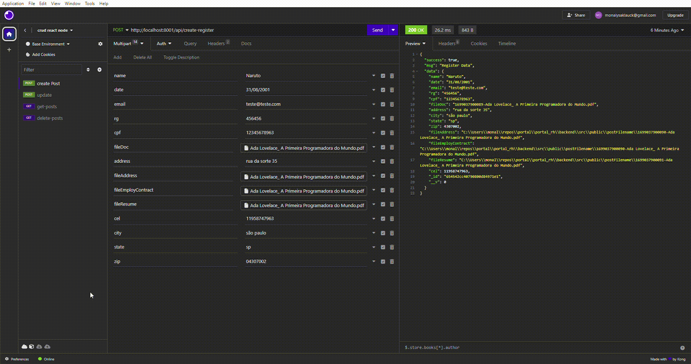

## Instalação do Mongo BD

- Passo 1: Instale o MongoDB:

Acesse o site oficial do MongoDB em https://www.mongodb.com/try/download/community e role para baixo até a seção "Community Server".

Escolha a versão apropriada para o seu sistema operacional (Windows, macOS ou Linux) e clique no botão de download correspondente.

Siga as instruções de instalação para o seu sistema operacional. O processo de instalação pode variar dependendo do sistema operacional, mas geralmente é um instalador simples que você precisa seguir.

- Passo 2: Inicie o MongoDB:

Após a instalação, você pode iniciar o MongoDB. No Windows, você pode encontrar o MongoDB na lista de programas instalados. No macOS e no Linux, você pode usar o terminal.

No Windows: Abra o menu Iniciar, encontre a pasta "MongoDB" e clique em "MongoDB Shell" para iniciar o cliente de linha de comando.

No macOS: Abra o terminal e digite o seguinte comando para iniciar o MongoDB:

bash
Copy code
mongod
No Linux: Abra o terminal e digite o mesmo comando mongod mencionado acima.

O MongoDB deve estar em execução agora.

- Passo 3: Conecte-se ao MongoDB:

Abra uma nova janela do terminal ou prompt de comando.

Para conectar-se ao servidor MongoDB, digite o seguinte comando:

bash
Copy code
mongo
Agora você está conectado ao servidor MongoDB e pode começar a usar o banco de dados.

- Passo 4: Interaja com o MongoDB:

Agora que você está conectado ao MongoDB, você pode criar bancos de dados, coleções e documentos, bem como executar consultas e operações de CRUD. Você pode usar comandos MongoDB ou criar aplicativos que interajam com o MongoDB, como o Node.js, que você mencionou anteriormente.

Lembre-se de que o MongoDB estará em execução enquanto a janela do terminal ou prompt de comando estiver aberta. Quando você quiser parar o servidor MongoDB, basta fechar a janela do terminal onde ele está sendo executado.

## Rodar o projeto 

### `npm install`

vai instalar o node_modules

### `npm start`

Se aparecer a mensagem de baixo `Rodando na porta 8001` é porque rodou corretamente.

``
> backend@1.0.0 start
> node index.js

Rodando na porta 8001

``

### Testar apenas o backend: 

Se quiser testar apenas a aplicação do backend sugiro testar em no `Insomnia` mas tambem pode testar em `postman`
- Abrir o insomnia 
- colocar a ação de POST inserir a rota http://localhost:8001/api/create-register
- colocar na opção `multipart-forms`
- inserir os dados conforme o models
- inserir as respostas 
e clicar em enviar

